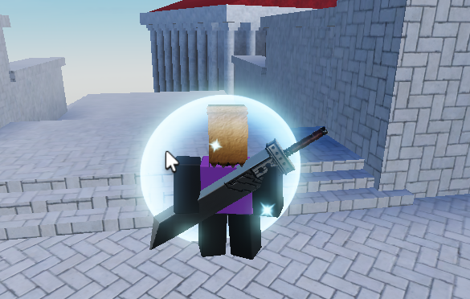
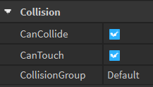
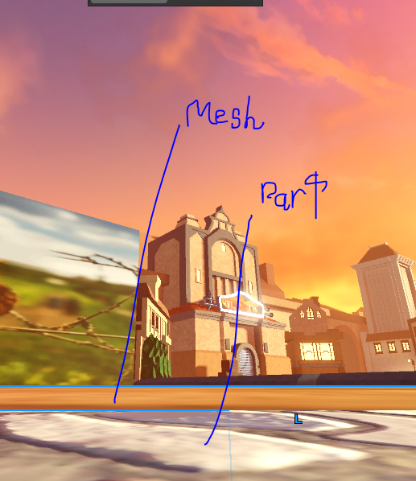
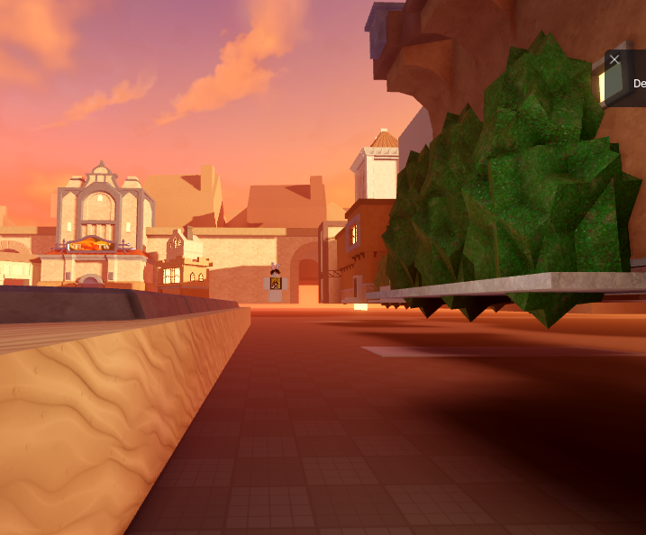
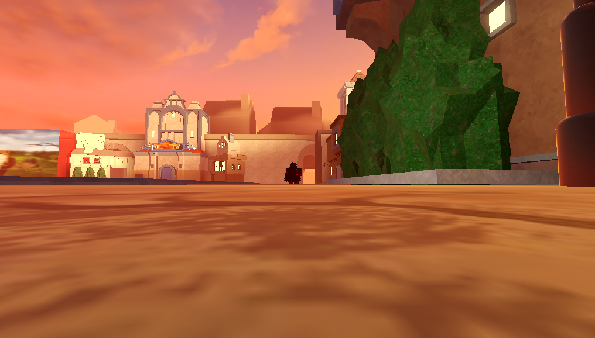

# Tags

## Introduction
Dissidia Battlegrounds uses [Tags](https://create.roblox.com/docs/reference/engine/classes/CollectionService) to manage collections of Instances that share common behaviour. This page documents the most commonly used Tags.

## InvisWalls
[BaseParts](https://create.roblox.com/docs/reference/engine/classes/BasePart) with this tag will act as invisible boundaries that react to the player's movements to emit a [ParticleEmitter](https://create.roblox.com/docs/reference/engine/classes/ParticleEmitter).

???+ note

    InvisWalls BaseParts are expected to have the following Collision Properties:

    

## CameraOccluder
CameraOccluders are [BaseParts](https://create.roblox.com/docs/reference/engine/classes/BasePart) that the camera cannot phase through. This is ideal for situations where you want to override Roblox's default camera occlusion.

By default, Roblox will occlude BaseParts that are:

1. Opaque (Transparency < 0.25)
2. Interactable (CanCollide = true)
3. Not in the same assembly as the subject (body parts of the character controlling the camera)

??? example

    The following is a scenario of a Model with 2 layers: a MeshPart that cannot collide and a Part beneath that is invisible but can collide.

    

    By default, this will not occlude, and the camera will clip through the ground.

    

    But with the CameraOccluder Tag on the invisible Part, it will occlude.

    