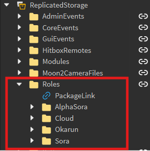

# Creating Movesets

## Introduction
Creating movesets is possibly the most repetitive and labour-intensive task for any Battlegrounds game; thankfully, Dissidia Battlegrounds has automated assets to make this a smooth process. This page will cover how you can work with these tools to get started with creating movesets.

!!! note

    To follow this guide you must be working in the *Testing* place, not the main place.

## Create a Role Folder
In-game, movesets are distinguished as Roles, and they all have a unique folder that stores their information in `ReplicatedStorage/Roles`.



It is ideal to make a copy of `ServerStorage/DevAssets/Templates/RoleTemplate` for this task, since certain instances require a [Path](path-interpreter/index.md) attribute that is already included within the template. The name that you decide to give to this folder is important to determine how the rest of the codebase will refer to the Role.


## Creating a Weapon

### From template
Once you've created a Role, you may notice that the template contains many Instances within it, we will focus on Weapons for now, this folder stores each Role's weapons. 


Weapons are an important type of Model, and every character must have at least one weapon(1). To create a Weapon model, simply make a copy of the *WeaponTemplate* within `ServerStorage/DevAssets/Templates/WeaponTemplate`.
{ .annotate }

1.  Weapons are responsible for:
    - Dash / Hit / Swing sounds.
    - Hit effects.


You may move it into workspace and change any of its visual properties(1), however, `Grip`, `Sounds`, `HitEffects` and `CritEffects` should remain untouched for now.
{ .annotate }

1.  Such as *Name*, *Trail* and *MeshPart*.


### Setting up Grip
!!! note

    This step will assume that you have the [Moon Animator 2 plugin](https://create.roblox.com/store/asset/4725618216/Moon-Animator-2).

Grip is a [Motor6D](https://create.roblox.com/docs/reference/engine/classes/Motor6D), it is what we use to animate the weapon. The easiest way to set its `C0` property is to create a copy of your existing weapon and positioning it relative to a dummy where you want it to go, then you may delete the `Grip` instance from this clone.


Now toggle Moon Animator's Easy Weld.


And set the *Base Part* to whatever bodypart you want the weapon to follow, then *Target Part* to `Handle`. Once you're done click *Join in Place*.


Moon Animator should have created a Motor6D named *Handle*, parented to *Base Part* (in this case, it's the Right Arm): You can now simply copy its `C0` property onto the original weapon's Grip. Additionally, you can start creating animations with the weapon you just welded.


To finish up, set the original weapon's `Grip` *Part0* attribute to the same name as the *Base Part*.


Now you may move the weapon into `<RoleFolder>/Weapons`.


### Assigning sounds
Head onto `<Weapon>.Handle.Sounds` and create Sounds for each attachment, you may preferably create more than one sound for all of these (except maybe Tackle). The name you give to the sounds does not really matter except for Hit, in which case the sound's name must be "Hit" .. `index`, where `index` refers to an integer(1).
{ .annotate }

1.  { align=left }
    This is how `Hit` is expected to be organized (there are 3 normal hits in every combo string).


The following is a list of when and how all of these sounds will play:

| Sound Attachment  | Description                          |
| ----------------- | ------------------------------------ |
| `FinisherHit`     | The last hit of a combo string, plays any random sound within it  |
| `FinisherSwing`   | The swoosh sound of FinisherHit, plays random as well |
| `Hit`             | Any normal hit within a combo string, plays sounds in order by their `index` suffix |
| `Swing`           | The swoosh sound for Hit, plays random |
| `Tackle`          | The sound(s) to play when the character lands a successful dash attack, every sound within this attachment will play at the same time |

### Assigning hit effects
There are two types of hit effects for each weapon, a normal hit effect and a critical hit effect. These effects must be created with [ParticleEmitters](https://create.roblox.com/docs/reference/engine/classes/ParticleEmitter), and they must be designed relative to an `Attachment`. Once you're done, you may place them under `<Weapon>/HitEffects` or `<Weapon>/CritEffects` respectively.


## Creating base animations
All the basic animations required for the role are located within `<RoleFolder>/Animations`, the automation system will take care of assigning them their proper places, so all you have to do is assign the animation id to these.


???+ info

    Combo 1 - 3 and Tackle last 30 frames

    - 0-10 frames windup
    - 10-15 frames attack
    - 15-30 frames punish

    Combo 4 and downslam last 35 frames

    - 0-10 frames windup
    - 10-15 frames attack
    - 15-35 frames punish

    Uppercut lasts 35 frames

    - 0-15 frames windup
    - 15-20 frames attack
    - 20-35 frames punish

## Default animation overrides (optional)
Each role has the option to override any of the default animations within `<Player>/Character/Animate`.


To override them, go to `<RoleFolder>/Animations` and create a [StringValue](https://create.roblox.com/docs/reference/engine/classes/StringValue) with the same name and the following attributes:

| Attribute | Type    | Value                 |
| --------- | ------- | --------------------- |
| Path      | string  | { character }.Animate |
| Replace   | boolean | true                  |

The [StringValue](https://create.roblox.com/docs/reference/engine/classes/StringValue) must have an [Animation](https://create.roblox.com/docs/reference/engine/classes/Animation) parented to it, additionally, you can set a custom speed animation value by assigning the following attribute:

| Attribute | Type    |
| --------- | ------- |
| Speed     | number  | 

On top of this, the same steps can be followed (except for assigning a `Replace` attribute) to create a custom run animation when a weapon is equipped, by naming the [StringValue](https://create.roblox.com/docs/reference/engine/classes/StringValue) `weaponrun`.

???+ example

    

## Creating accessories (optional)
???+ tip

    The following code will spawn an accessory model, you may paste it into the Roblox Studio command bar:
    ```lua
    local cHS = game:GetService("ChangeHistoryService")
    local iS = game:GetService("InsertService")
    local sS = game:GetService("Selection")

    cHS:SetWaypoint("CatalogItemLoaded")
    local id = 111111 -- your accessory id here
    local item: Model = iS:LoadAsset(id)
    item.Parent = game.Workspace 
    sS:Set({item})

    local camera = workspace.Camera
    camera.CFrame = CFrame.new(item.WorldPivot.Position) * camera.CFrame.Rotation * CFrame.new(0, 0, 15)
    ```

Now just drag the accessory out of the model and place it inside `<RoleFolder>/Accessories`.


Finally, you'll have to set the accessory's *Path* attribute to `{ character }`. This will allow the [PathInterpreter](path-interpreter/index.md) module to parent the accessory to the character when they spawn.


## Guard effects
There are two types of guard effects for guarding: default and parry. Both of these shall have unique sound and visual effects.

You may place each corresponding sound on their respective `Attachment`.


You may place each corresponding ParticleEmitter on their respective `Attachment`.


## Weapons for specific actions
Sometimes, you may want to use different weapons for specific actions, for example, if a character has two swords. To facilitate this process, you can use `weaponBinds`(1). You can find this table within the `<RoleFolder>/CharacterModule` ModuleScript.
{ .annotate }

1.  `weaponBinds` is a dictionary storing an array of strings representing Weapon names that may be summoned for each corresponding
    action. You may summon more than a single weapon for each action.

```lua
local weaponBinds = {
	-- NOTICE: Default is the only non optional field, every other field will return Default
	-- if it is not defined (see metatable below)
	Default = {"WeaponName"},
	Guard = {"WeaponName"},
	Awaken = {"WeaponName"},
	Attack1 = {"WeaponName"},
	Attack2 = {"WeaponName"},
	Attack3 = {"WeaponName"},
	Attack4 = {"WeaponName"},
	Uppercut = {"WeaponName"},
	Downslam = {"WeaponName"},
	Run = {"WeaponName"}
}

local bindsMetatable = {
	-- Force any undeclared actions to Default
	__index = function(t: table)
		return t.Default
	end,
}

CharacterModule.WeaponBinds = setmetatable(weaponBinds, bindsMetatable)
```

## Creating skills

### Local Scripts
Every local script used for skill input is stored within `Roles/<RoleFolder>/Skillset`. All LocalScripts under this folder must be disabled.


To make the creation of these scripts easier, there's a template located in `ServerStorage/DevAssets/ClientSkillTemplate`, containing the necessary tags, attributes and code for the skill to function.


The following table documents the behaviour of the script's attribute:

| Attribute | Type | Description |
| - | - | - |
| `Awakening` | boolean | Whether or not the skill is exclusive to awakening |
| `Cooldown` | number | The cooldown of the skill in seconds |
| `Description` | string? | (Optional) A short string representing a unique characteristic of the skill |
| `Keybind` | number | An integer ranging from 1-4 indicating which number key will activate the skill |
| `LastActionTime` | number | A number representing the last time when the skill was activated. Do not touch this attribute |
| `SkillExemption` | boolean | If set to true, will allow the local script to receive input no matter what the `Awakened` attribute says |
| `Skillset` | string | A string representing the Role's name |

!!! info

    Whatever name is given to the LocalScript will be used for the skill's title in GUI. PascalCase must be used for the code to know where to put spaces.

### Server Scripts
All server scripts for skills are located within `ServerScriptService/SkillScripts`. You may create a new folder here, and give it the same name as the [Role folder](create-moveset.md/#create-a-role-folder), then, you can make a copy of `ServerStorage/DevAssets/Templates/ServerSkillTemplate` and parent it to the folder. The server Script must have the same name as the [skill's LocalScript](create-moveset.md/#local-scripts).


Before you start editing this script, you must also create a [RemoteFunction](https://create.roblox.com/docs/reference/engine/classes/RemoteFunction) that calls it. The name must be the same as the script's name plus a "Function" suffix, so if the script is called `BladeBeam`, the RemoteFunction's name will be `BladeBeamFunction`.


### Client-sided VFX
*[VFX]: Visual Effects

If you read the first few lines of the [server Script](create-moveset.md/#server-scripts), you will notice this:
```lua
local skillVisualEvent = ReplicatedStorage.SkillVisualEvent
```
This event is responsible for requesting client-sided VFX to play, the event receiver in question is located in `StarterPlayer/StarterPlayerScripts/PlayerSetup`, and this is what it expects to receive:
```lua
-- #  Create skill visual effects on server request
skillVisualEvent.OnClientEvent:Connect(function(roleName: string, skillIndex: number, paramTable: table)
    local character = player.Character
    local status = character.Status
    
    local fxModule = modules[roleName]
    fxModule["skill" .. skillIndex](table.unpack(paramTable))
end)
```
As you can see, it calls a function from a ModuleScript located within `StarterPlayerScripts/PlayerSetup/ModulesVFX`, this is where you may create a VFX ModuleScript, the expected structure of it is as follows:
```lua
local Effects = {}

Effects.skill0 = function()
	-- 0th skill is reserved for summoning weapons
end

Effects.skill1 = function()
	
end

Effects.skill2 = function()

end

Effects.skill3 = function()

end

Effects.skill4 = function()

end

return Effects
```

??? tip

    For better organisation, it is recommended to have each individual skill function as its own ModuleScript:
    ```lua
    -- # Skill imports
    local Sheathe = require(script:WaitForChild("Sheathe"))
    local FinishingTouch = require(script:WaitForChild("FinishingTouch"))
    local SonicBlade = require(script:WaitForChild("SonicBlade"))
    local Meteorain = require(script:WaitForChild("Meteorain"))
    local Omnislash = require(script:WaitForChild("Omnislash"))

    -- # Module declaration
    local Effects = {}

    Effects.skill0 = Sheathe

    Effects.skill1 = FinishingTouch

    Effects.skill2 = SonicBlade

    Effects.skill3 = Meteorain

    Effects.skill4 = Omnislash

    return Effects
    ```

Each Role is expected to have 2 VFX module scripts: one for its basic skillset and one for its awakening skillset. Both modules must have the same name as the [Role folder](create-moveset.md/#create-a-role-folder), with the awakening module having an "Awaken" suffix.


## Weapon summoning
Let's look back at the code in the VFX module, notice this method:
```lua
Effects.skill0 = function()
    -- 0th skill is reserved for summoning weapons
end
```
This is the function to be called whenever a character equips a weapon, it allows you to handle client-sided VFX for it however you'd like. This method is triggered by `<RoleFolder>/CharacterModule`, more specifically, it is the functions within the `summonFunctions` table that take care of this:
```lua
summonFunctions.ExampleWeaponName = function(character: Model, weapon: Model, isHidden: boolean)
    -- TODO: Server-side summoning

    -- Fire 0th skill function to all clients
    skillVisualEvent:FireAllClients(roleName, 0, {character, weapon, isHidden})
end
```
However, this name won't do. Summon functions are index based on the [Weapon Model's](create-moveset.md/#creating-a-weapon) name, for example, Cloud's Weapon is named "BusterSword", so his summon function would look like `summonFunctions.BusterSword`.

If you don't have any given weapon to have a summon effect when they are equipped, you can simply not include it in the table, as it has a metamethod to catch nil-index errors:
```lua
local summonMetatable = {
    -- Returns an empty function to catch errors when there's a nil index
    __index = function()
        return function() end
    end
}
```

## Awakening effects
When a character triggeres an awakening, you usually expect some sort of flashy visual and sound effects to play.

### Server-side effects
The server-side awakening scripts can be found in `ServerScriptService/AwakenServer/Modules`, make a new one and rename it to the [Role's](create-moveset.md/#create-a-role-folder) name.


`AwakenServer` will call the module's `Awaken` function:
```lua
-- # Services
local ReplicatedStorage = game:GetService("ReplicatedStorage")

-- # Variables
local awakenVFXEvent = ReplicatedStorage.AwakenVFXEvent

-- # Module definition
local Cloud = {}

Cloud.Awaken = function(player: Player, character: Model)
    -- This function is called on server when the player awakens
    
    local extraParams = {character, "param2", "param3"}
    awakenVFXEvent:FireAllClients("Cloud", extraParams)
end

return Cloud
```

??? tip

    Every awakening should have its own theme song, when you add a sound for this it's helpful to use `ServerScriptService/AwakenServer/AwakenUtils.playAwakeningMusic()`, as it will handle all expected behaviour of the sound for you.

### Client-side effects
The client-sided VFX for awakening are located within `StarterPlayer/StarterCharacterScripts/AwakenClient/Modules`. Create a new module script here and name it after the Role.


This ModuleScript is expected to have the following variables:
```lua
local Cloud = {}

Cloud.AnimationId = 0 -- Animation id that will play when the player awakens

Cloud.LocalVFX = function()
    -- This function will only display VFX to the player that triggered awakening
end

Cloud.GlobalVFX = function(casterCharacter: Model, ...)
    -- This function will display VFX for every player in game
end

return Cloud
```

### Graphic User Interface
Every role has a unique awakening name and color gradient that displays on their hotbar, you can configure this in `Roles/<RoleFolder>/CharacterModule.AwakenInfo`:
```lua
CharacterModule.AwakenInfo = {
    Name = "AWAKENING TITLE",
    BarColorSequence = ColorSequence.new{
        ColorSequenceKeypoint.new(0, Color3.new(0.628473, 0.967178, 0.464561)),
        ColorSequenceKeypoint.new(1, Color3.new(0.381827, 0.816831, 0.0540017))
    }
}
```


## Character selection
The character selection GUI is handled by [Forever HD's TopbarPlus](https://1foreverhd.github.io/TopbarPlus/), however, to create an icon you must declare a table in either `ReplicatedStorage/Modules/CharacterSelection.roles` or `ReplicatedStorage/Modules/CharacterSelection.specialRoles`:
```lua
CharacterSelection.roles = {
	-- Add new Roles here available to all players
	{
		RoleName = "Sora",
		Image = 17279130810, -- Icon image for character selection in main game
		ThumbnailImage = 17283413458, -- Thumbnail image for character selection in "The Struggle" game mode
		Label = "Sore Sky" -- Icon's label
	}
}

CharacterSelection.specialRoles = {
	-- Special roles that may not always show up as they are not available to all players.
	-- All special roles must have a condition function to evaluate whether or not they will
	--	show up for a given player.
    RoleName = "Okarun",
    Image = 95150705139900,
    ThumbnailImage = 95150705139900,
    Label = "Okarun",
    Condition = function(): boolean
        local player = Players.LocalPlayer
        local rank = player:GetRankInGroup(GROUP_ID)
        local id = player.UserId
        
        return rank >= DEV_RANK or table.find(OKARUN_WHITELIST, id)
    end,
}
```


## Unique Attributes
The following is a list of attributes that may be added to the [role folder](create-moveset.md/#create-a-role-folder):

|   Attribute   | Type | Description |
| - | - | - |
| `DevOnly`     | boolean | If true, this Role will only be accessible to developers of the game, with the exception of users listed under `<RoleFolder>/USER_WHITELIST` |
| `EarlyAccess` | boolean | If true, this Role will only be accessible to players that own the Early Access [pass](https://www.roblox.com/game-pass/762761003/Early-Access) or gift |