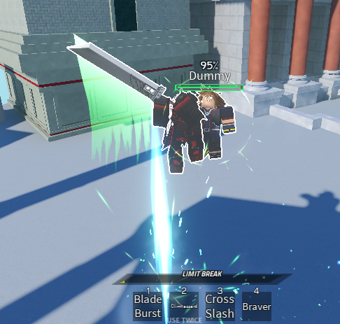

# Air Combo

## Introduction
**Dissidia Battlegrounds** introduces a unique air combo mechanic that is not seen in any other fighting game.

Air combos allow players to remain airborne as long as they keep dealing damage to a character in the air, the point of this mechanic is to allow different routes to a combo from a single move.

??? example

    Cloud's Climhazzard has  "use twice" functionality, where using it twice will slam the victim into the ground to deal heavy damage, while not using the ability twice will instead start an air combo.

    

## How it works

---

#### Start an air combo
```lua
ServerUtils.airCombo(attacker: Model, victim: Model, elevation: number?, floatingTime: number?)
```

Sets up an air combo between the attacker and victim at the given elevation from their current position.

| Parameter              | Description                                                                                                |
| ---------------------- | ---------------------------------------------------------------------------------------------------------- |
| attacker: Model        | The character model of the attacker.                                                                       |
| victim: Model          | The character model of the victim.                                                                         |
| elevation: number?     | The elevation, in studs, at which the air combo will be started from the attacker's position. Default: 15. |
| floatingTime: number?  | For how long will both the attacker and victim be held in the air. Default: 0.9                            |

---

#### Cancel an air combo
```lua
ServerUtils.airComboCancel(character: Model)
```

Cancels air combo state on the given character.

| Parameter        | Description                                      |
| ---------------- | ------------------------------------------------ |
| character: Model | The character whose air combo will be cancelled. |