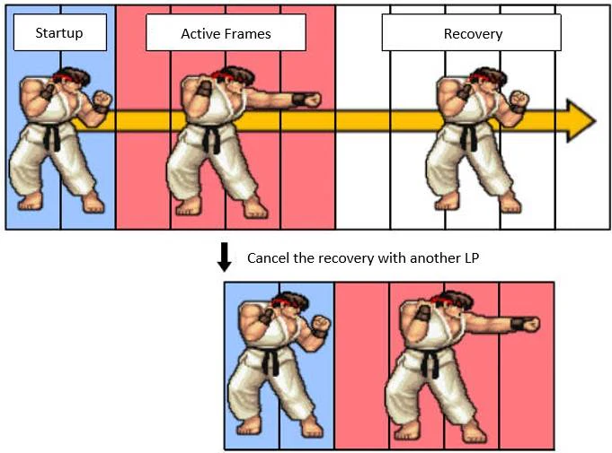

# Animation Cancelling

## Introduction

!!! quote

    The basic idea behind animation cancel is to interrupt an animation sequence before it is completed, allowing the player to perform a new action more quickly. For instance, in a fighting game, a player can cancel the end lag of a heavy attack into a block, allowing them to defend more efficiently after attacking.
    
    \- Johnathon Reyes

{ width="300" }

Not to be confused with [stun cancelling](stun.md#cancel-stun), animation cancelling will only allow a character to cancel a stun early by performing any action such as dashing, guarding, or even attacking.

## How it works
```lua
ServerUtils.animCancel(character: Model)
```

Allows a player to cancel their animation out of an ongoing attack, commonly used when a move with a lot of end lag successfully lands.

| Parameter        | Description                                             |
| ---------------- | ------------------------------------------------------- |
| character: Model | The character who is allowed to cancel their animation. |