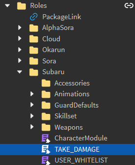

# Damage

!!! warning

    Do not change a [Humanoid](https://create.roblox.com/docs/reference/engine/classes/Humanoid)'s health directly through `Humanoid.Health` or `Humanoid:TakeDamage()`.

## Introduction
Damage is influential to many components of the game, for this reason, a custom method is used to deal damage to [Humanoids](https://create.roblox.com/docs/reference/engine/classes/Humanoid).

`ServerUtils.takeDamage` deals a certain amount of damage to the target character's [Humanoid](https://create.roblox.com/docs/reference/engine/classes/Humanoid) based on the length of the combo (unless damage reduction is manually set to be ignored), where the longer the combo drags out, the less damage it does. This effectively serves as a measure to counteract potentially infinite combos. It is also tasked with rewarding [Focus](focus.md) to the character dealing damage.

Similar to `Humanoid:TakeDamage()`, no damage will be dealt to characters with a [ForceField](https://create.roblox.com/docs/reference/engine/classes/ForceField).

## How it works

#### Take damage

```lua
ServerUtils.takeDamage(character, amount, ignoreDamageReduction)
```

The rate of damage reduction is 15% per second, with the minimum amount of damage being 1.
The [Focus](focus.md) to be rewarded to the attacker is determined as the net amount of damage dealt to the victim multiplied
by the attacker player's `FocusMutliplier` [attribute](https://create.roblox.com/docs/studio/properties#instance-attributes).

The attacker character is determined through the victim's `CreatorTag`, an [ObjectValue](https://create.roblox.com/docs/reference/engine/classes/ObjectValue) which holds the last character to attack the victim.

| Parameter                         | Description                                                                                 |
| --------------------------------- | ------------------------------------------------------------------------------------------- |
| character: Model                  | The character whose Humanoid will take damage.                                              |
| amount: number                    | The amount of damage to be dealt.                                                           |
| ignoreDamageReduction : boolean?  | If true, the character will take exactly `amount` damage. This is ideal for finisher moves. |

#### Passive abilities against taking damage

You may create a module that is invoked prior to receiving damage by placing the module inside `ReplicatedStorage/Roles/<RoleFolder>` and naming it `TAKE_DAMAGE`.



The module is expected to return a method to be invoked. If the method returns `false`, damage will be nullified.

???+ example

    The following code will nullify damage if the amount to be taken would kill the humanoid.

    ```lua
    local function takingDamage(character: Model, amount: number)
        local humanoid: Humanoid = character.Humanoid

        return humanoid.Health > amount -- nullify damage if it kills
    end

    return takingDamage
    ```