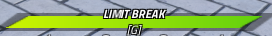

# Focus

## Introduction
Awakenings are a common feature in Battleground games. For a player to awaken, they need to fill up their awakening bar.

In Dissidia Battlegrounds, we call Focus to the unit that fills this bar. It has a minimum value of 0 and a maximum value of 1.



## How it works

#### Attribute
Focus is stored as an [attribute](https://create.roblox.com/docs/studio/properties#instance-attributes) inside each player. You may manually change this attribute to control Focus, but it is normally unnecessary as the [damage](damage.md) mechanic already takes care of rewarding Focus.

#### Multiplier
Each player has an individual `FocusMultiplier` attribute that is used the moment Focus is to be rewarded to them using `ServerUtils.takeDamage()`. By default, the value is 0.5, but it can be altered by changing the `FocusMultiplier` [attribute](https://create.roblox.com/docs/studio/properties#instance-attributes) within `ServerScriptService/ServerSetup`.

#### Awakening duration
Awakenings are set to last 45 seconds by default, as the awakening drains the Focus bar at a rate of 100 Focus per 45 seconds. You can change this value through the `AwakeningDuration` [attribute](https://create.roblox.com/docs/studio/properties#instance-attributes).

## Example
```lua
-- This code maxes out the awakening bar
player:SetAttribute("Focus", 100)
```